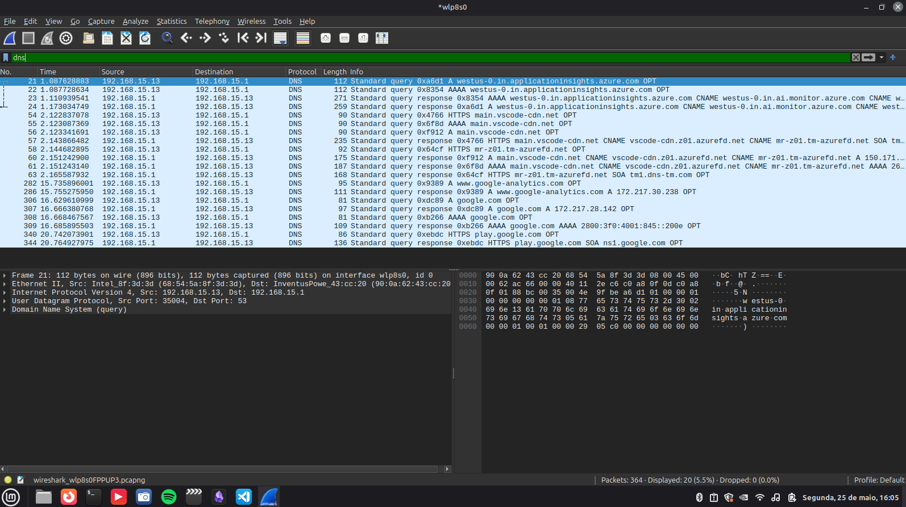

### Relatório de Captura - Exercício 7: Consultas DNS
Trabalho 2 - Redes de Computadores 2
Professor: Prof. Alessandro Vivas Andrade
Integrantes: Alisson de Souza Rocha, José Inácio de Moraes Santos, Rafael Gomes da Silva

### Exercício 7: Utilizando o software Wireshark capture o tráfego de consultas DNS

## 1. Abra o Wireshark e aplique o filtro de protocolo
## 2. Execute uma consulta de nome de domínio no terminal utilizando um utilitário nativo
## 3. Interrompa a captura e filtre os resultados
## 4. Analise os pacotes de requisição (Query) e resposta (Response) para identificar a tradução do domínio em endereço IP

### Respostas exercício 7

## 1. Abra o Wireshark e aplique o filtro de protocolo

# Iniciei a captura na interface de rede sem fio ativa (wlp8s0)
# Defini o filtro de exibição no topo do Wireshark para isolar o protocolo da camada de aplicação: dns

## 2. Execute uma consulta de nome de domínio no terminal utilizando um utilitário nativo

# Utilizei o terminal Linux para forçar uma resolução de nome direta através do utilitário de diagnóstico: nslookup google.com
# O comando consultou com sucesso o servidor DNS configurado na rede local para obter os registros associados ao domínio

## 3. Interrompa a captura e filtre os resultados

# Interrompi a gravação de pacotes clicando no botão de parada do Wireshark
# O filtro aplicado removeu o tráfego concorrente e exibiu a sequência exata de requisições e respostas sobre o protocolo UDP na porta 53
# 

## 4. Analise os pacotes de requisição (Query) e resposta (Response) para identificar a tradução do domínio em endereço IP

# Pacote 306 (Standard query): O host local (192.168.15.13) envia uma requisição DNS do tipo "A" para o servidor DNS padrão (192.168.15.1) solicitando o endereço IPv4 para o domínio google.com
# Pacote 307 (Standard query response): O servidor DNS responde ao host local retornando com sucesso o registro "A" contendo o endereço IP resolvido: 172.217.28.142
# Pacote 308 (Standard query): O host local realiza uma nova requisição DNS paralela do tipo "AAAA", solicitando o mapeamento do mesmo domínio para o formato de endereçamento IPv6
# Pacote 309 (Standard query response): O servidor DNS retorna a resposta contendo o endereço IPv6 correspondente (2800:3f0:4001:845::200e) associado ao host do Google