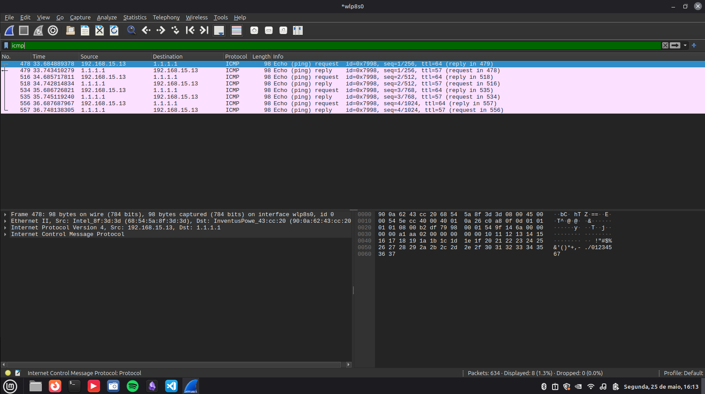

### Relatório de Captura - Exercício 8: Pacotes ICMP
Trabalho 2 - Redes de Computadores 2
Professor: Prof. Alessandro Vivas Andrade
Integrantes: Alisson de Souza Rocha, José Inácio de Moraes Santos, Rafael Gomes da Silva

### Exercício 8: Utilizando o software Wireshark capture o tráfego ICMP gerado pelo comando ping

## 1. Abra o Wireshark e configure o filtro de protocolo de diagnóstico
## 2. Execute o comando ping no terminal direcionado a um host remoto
## 3. Interrompa a captura após a conclusão dos testes
## 4. Analise os pacotes gerados identificando o mecanismo de Request e Reply

### Respostas exercício 8

## 1. Abra o Wireshark e configure o filtro de protocolo de diagnóstico

# Iniciei uma nova captura de pacotes na interface de rede sem fio ativa (wlp8s0)
# Apliquei o filtro de exibição para isolar mensagens de controle da camada de rede: icmp

## 2. Execute o comando ping no terminal direcionado a um host remoto

# Utilizei o terminal do Linux para disparar o utilitário de teste de conectividade ICMP
# Executei o comando configurado para interromper após 4 envios: ping -c 4 google.com
# O terminal exibiu a estatística de pacotes transmitidos e recebidos com success e 0% de perda

## 3. Interrompa a captura após a conclusão dos testes

# Parei a captura de dados no botão de interrupção do Wireshark após o término do comando no terminal
# O painel exibiu o fluxo simétrico de pacotes de eco trafegados na rede local após a aplicação correta do filtro
# 

## 4. Analise os pacotes gerados identificando o mecanismo de Request e Reply

# O tráfego consistiu na sequência alternada de mensagens do tipo Echo Request (solicitação) e Echo Reply (resposta)
# Primeiro pacote (Echo ping request): O host local (192.168.15.13) envia uma mensagem ICMP Type 8 (Echo Request) para o IP de destino do Google testando a acessibilidade na camada de rede
# Segundo pacote (Echo ping reply): O servidor remoto responde ao host local com uma mensagem ICMP Type 0 (Echo Reply), confirmando que o destino está ativo e fornecendo os dados para cálculo do RTT
# O ciclo se repetiu de forma idêntica para os demais pacotes subsequentes da amostragem, totalizando 4 requisições e 4 respostas bem-sucedidas na captura