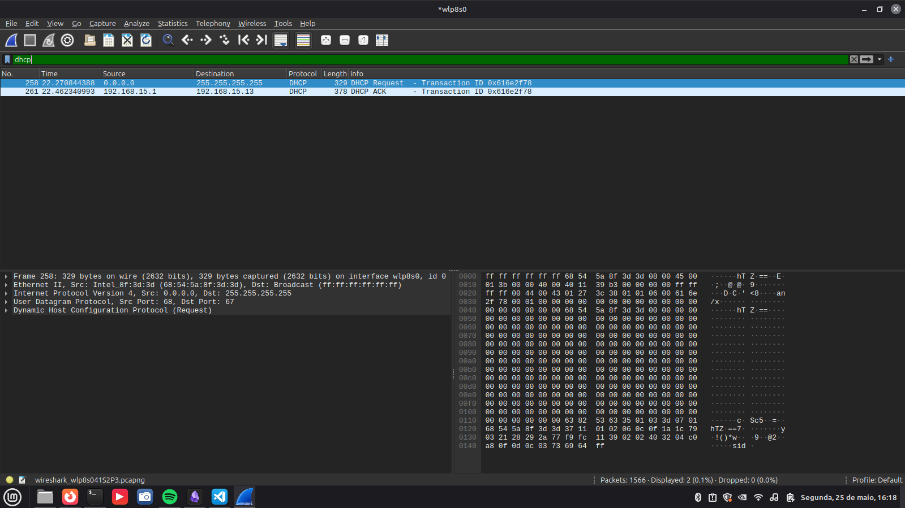

### Relatório de Captura - Exercício 9: Pacotes DHCP
Trabalho 2 - Redes de Computadores 2
Professor: Prof. Alessandro Vivas Andrade
Integrantes: Alisson de Souza Rocha, [Nome do Integrante 2], [Nome do Integrante 3]

### Exercício 9: Utilizando o software Wireshark capture os pacotes DHCP gerados na configuração automática de IP da sua máquina

## 1. Abra o Wireshark e configure o filtro para o protocolo de alocação dinâmica
## 2. Force a renovação do endereço IP da interface de rede utilizando o terminal Linux
## 3. Interrompa a captura de dados após o restabelecimento da conectividade
## 4. Analise as quatro etapas fundamentais que compõem o ciclo de obtenção de parâmetros de rede (DORA)

### Respostas exercício 9

## 1. Abra o Wireshark e configure o filtro para o protocolo de alocação dinâmica

# Iniciei a captura de tráfego na interface de rede local sem fio (wlp8s0)
# Apliquei o filtro de exibição para isolar mensagens do serviço de configuração dinâmica de hosts: dhcp

## 2. Force a renovação do endereço IP da interface de rede utilizando o terminal Linux

# Utilizei o terminal para forçar a reinicialização lógica do link e a renovação dos parâmetros de rede através do gerenciamento da interface de rede
# Executei os comandos de controle: sudo ip link set dev wlp8s0 down && sudo ip link set dev wlp8s0 up
# A ação forçou a pilha de protocolos a restabelecer o vínculo físico e solicitar a renovação dos dados de IP junto ao roteador

## 3. Interrompa a captura de dados após o restabelecimento da conectividade

# Interrompi a gravação de pacotes através do botão de parada do Wireshark assim que a interface obteve as novas configurações lógicas
# O painel exibiu o tráfego de broadcast e unicast trocado entre o host cliente e o servidor DHCP da sub-rede
# 

## 4. Analise as quatro etapas fundamentais que compõem o ciclo de obtenção de parâmetros de rede (DORA)

# DHCP Discover: O host cliente envia uma mensagem inicial em broadcast procurando por servidores DHCP ativos na rede física
# DHCP Offer: O servidor DHCP (roteador) responde oferecendo uma configuração prévia de IP válida
# Pacote 258 (DHCP Request): O host local utiliza o endereço de origem temporário 0.0.0.0 e envia uma mensagem em broadcast para o destino geral 255.255.255.255, informando o Transaction ID 0x616e2f78 e aceitando formalmente os parâmetros ofertados pelo servidor DHCP
# Pacote 261 (DHCP ACK): O servidor DHCP (192.168.15.1) responde de forma direcionada (unicast) para o IP definitivo alocado ao host local (192.168.15.13), confirmando o registro da concessão com o mesmo Transaction ID e finalizando o processo de configuração automatizada